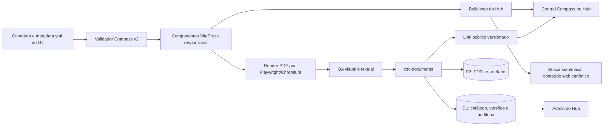

# Plano de Transição — Compass™ v2

## 1. Decisão executiva

A transição deve seguir a **opção C**, com evolução do motor de publicação e migração progressiva das edições 001/2026 a 008/2026. A edição 008 será o **golden master editorial** do Compass™ v2. As edições 001 a 007 serão reprocessadas pelo novo motor sem reescrita do conteúdo técnico, salvo correções objetivas de metadados aprovadas e registradas.

A arquitetura recomendada preserva o Git como **fonte única da verdade editorial**, usa o VitePress para a experiência web responsiva, Playwright/Chromium para gerar o PDF A4 a partir do mesmo HTML/CSS, o `csv-documents` para versionamento e distribuição dos PDFs, o D1 somente para metadados operacionais e o R2 para arquivos binários. Não é recomendada a criação de outro Worker específico para o Compass nem a duplicação do catálogo em um segundo banco.

| Princípio | Decisão |
|---|---|
| Fonte editorial | Git, no repositório `grupocsv/hub` |
| Web | VitePress com componentes Compass v2 responsivos |
| PDF | Playwright/Chromium sobre o mesmo HTML/CSS, com CSS de impressão |
| Arquivos binários | R2 privado existente do `csv-documents` |
| Catálogo operacional | D1 existente do `csv-documents` |
| Download | Links públicos versionados do `csv-documents`, mantendo URLs antigas durante a transição |
| Administração | Nova aba Compass™ no Admin do Hub, sem edição livre de conteúdo na primeira versão |
| Motor anterior | Mantido enquanto cada edição não concluir a migração e o aceite |
| n8n | Sem alteração obrigatória; reservado apenas para uma automação editorial futura, se aprovada |

## 2. Hierarquia canônica de marcas

A identidade institucional deve ser idêntica em todas as edições, independentemente do ano ou do motor utilizado.

> **Compass™ — um produto do Grupo CSV | Responsabilidade editorial: MedValor®**

A marca **Grupo CSV** permanece em primeiro plano. A **MedValor®** assume explicitamente a responsabilidade editorial. A **AxiaCare®** permanece nos mesmos locais funcionais do modelo 008, como marca de elaboração e aplicação nas consultorias e assessorias, pois é a referência reconhecida pelos leitores finais.

| Elemento | Regra canônica |
|---|---|
| Produto | Compass™ |
| Propriedade | Um produto do Grupo CSV |
| Responsabilidade editorial | MedValor® |
| Elaboração e aplicação | AxiaCare®, nos locais definidos pelo modelo 008 |
| Marca principal na capa | Grupo CSV |
| Metadados, cabeçalhos e rodapés | Repetir a hierarquia sem substituir o Grupo CSV pela unidade responsável |
| Uso de símbolos | `™` em Compass™ e `®` em MedValor® e AxiaCare® |

Essa redação deverá ser aplicada à capa, contracapa, metadados, página web, catálogo, Admin, `_infra`, README, manifesto e informações de download.

## 3. Diagnóstico verificado

O motor atual tem duas implementações visuais independentes. A web usa Markdown enriquecido com HTML/CSS no VitePress. O PDF é redesenhado por `tools/compass-pdf/compass-pdf-gen.py`, que interpreta o Markdown por expressões regulares e usa `fpdf2`. Essa separação permite divergências entre web e PDF e não cobre componentes necessários ao 008, como seis SVGs, aberturas de capítulo, sumário diagramado, cards executivos, diagramas temporais e contracapa autoral.

O pacote 008 contém 23 páginas, 13 tabelas, 6 SVGs, 5 figuras e 91 parágrafos. Sua qualidade editorial é superior, mas o HTML recebido não pode ser publicado diretamente: a estrutura fecha `body` e `html` após a quinta página, deixando 18 páginas fora da árvore válida, e o layout A4 fixo apresenta corte horizontal em viewport móvel de 390 px. Portanto, o 008 deve ser **normalizado e componentizado**, não simplesmente copiado.

| Achado histórico | Tratamento no plano |
|---|---|
| Duas árvores, `compass/` e `docs/compass/` | Eleger `docs/compass/` como fonte canônica. Durante a compatibilidade, gerar `compass/` por script a partir dessa fonte, proibir edição manual do espelho e adicionar teste que falhe diante de divergência; eliminar a duplicação ao final da migração. |
| Gerador por regex e FPDF | Congelar como v1; não ampliar suas capacidades. |
| Ausência de testes específicos | Criar contratos de edição, testes de conteúdo, visual, impressão, links e download. |
| Edições 001–006 com esquema de metadados antigo | Migrar para schema v2 sem apagar o YAML original até o aceite. |
| Edição 007 com esquema divergente | Criar adaptador explícito e normalizar para schema v2. |
| PDFs 005 e 006 com numeração interna cruzada | Corrigir como erro de metadado durante a migração, preservando cópia e hash dos originais. |
| PDFs históricos acessíveis em produção, mas não igualmente presentes na árvore local | Recuperar, calcular SHA-256 e registrar cada original como versão v1 antes da substituição. |
| Admin sem área Compass | Criar aba dedicada e protegida. |
| `_infra` descreve apenas VitePress + PDF timbrado | Atualizar para a arquitetura completa do v2. |

## 4. Arquitetura-alvo



O conteúdo técnico ficará em arquivos semânticos. O motor v2 produzirá a versão web e a versão impressa a partir da mesma composição, com folhas de estilo diferentes para `screen` e `print`. O PDF não será gerado dentro de uma requisição Worker.

### 4.1 Estrutura proposta no repositório Hub

```text
docs/compass/
  index.md
  catalog.json                 # gerado; catálogo público das edições
  schema/
    edition.schema.json
  components/
    CompassCover.vue
    CompassSummary.vue
    CompassChapter.vue
    CompassMetricCards.vue
    CompassTable.vue
    CompassTimeline.vue
    CompassReferences.vue
    CompassBackCover.vue
  styles/
    tokens.css
    screen.css
    print.css
  edicoes/2026/008/
    index.md                   # entrada VitePress fina
    content.md                 # conteúdo semântico
    metadata.yml              # contrato v2
    assets/
    qa/
      baseline.json
      expected-text.txt
scripts/compass/
  validate-edition.mjs
  build-catalog.mjs
  render-pdf.mjs
  compare-text.mjs
  visual-regression.mjs
  migrate-legacy.mjs
  release-edition.mjs
tests/compass/
  schema.test.mjs
  content-parity.test.mjs
  routes.test.mjs
  download.test.mjs
  visual.spec.mjs
```

A pasta `qa/` não deverá conter imagens volumosas no histórico comum. Baselines pesadas e PDFs de referência ficarão no R2 ou em artefatos do workflow, com hashes registrados no Git.

### 4.2 Contrato de metadados v2

O schema deverá ser validado antes do build. Exemplo resumido:

```yaml
schema_version: 2
id: "008/2026"
slug: "008-2026-marcos-temporais-alta-substituicao-leito"
product: "Compass™"
product_owner: "Grupo CSV"
editorial_responsibility: "MedValor®"
elaboration: "AxiaCare®"
title: "Marcos Temporais do Processo de Alta e da Substituição do Leito"
status: "review"
engine_version: "2.0.0"
template_version: "2.0.0"
publication_date: null
web_path: "/compass/edicoes/2026/008/"
legacy_paths: []
source_ref: "git:<commit>:docs/compass/edicoes/2026/008/content.md"
artifacts:
  pdf_document_id: null
  pdf_version_id: null
  public_link_slug: null
  sha256: null
indexing_policy: "full_text_web_only"
```

O status inicial do 008 deverá ser `review` até a aprovação editorial explícita. A integração ao repositório, ao preview e ao QA ocorre antes dessa decisão; a visibilidade pública e o rótulo `Publicado` ficam bloqueados pelo gate de publicação.

## 5. Motor de renderização Compass v2

### 5.1 Decisão técnica

O primeiro motor v2 deverá usar **Playwright/Chromium**, já presente no Hub, porque o 008 foi produzido e visualmente validado em Chromium. A API `page.pdf()` suporta CSS `@page`, fundos, tamanho de página definido pelo CSS, outline e PDF marcado. Paged.js poderá ser avaliado posteriormente se o Compass passar a receber conteúdo sem paginação deliberada; não deve ser introduzido no primeiro release, pois adicionaria outra camada de paginação antes de estabilizar o contrato editorial.[1][2]

### 5.2 Alterações necessárias

1. Substituir o HTML monolítico do 008 por componentes semânticos reutilizáveis, preservando integralmente texto, tabelas, SVGs e ordem editorial.
2. Separar tokens, estilos de tela e estilos de impressão.
3. Implementar layout responsivo real; no mobile, a edição deve refluír sem simular uma folha A4 reduzida.
4. Usar CSS `@page` e quebras explícitas somente na mídia de impressão.
5. Carregar as fontes Inter, JetBrains Mono e Grifter de forma determinística e com licenças/documentação registradas.
6. Esperar `document.fonts.ready`, imagens e SVGs antes de gerar o PDF.
7. Fixar metadados de PDF e eliminar timestamps variáveis para aumentar a reprodutibilidade.
8. Gerar `manifest.json` por edição com hashes do conteúdo, assets, HTML de entrada e PDF.
9. Manter o gerador FPDF v1 disponível somente para reproduzir edições ainda não migradas.
10. Excluir qualquer fallback silencioso de número, data, edição ou marca; ausência de campo obrigatório deve interromper o build.

### 5.3 Critérios de aceite do motor

| Critério | Verificação |
|---|---|
| HTML válido | Parser HTML + teste de fechamento e aninhamento; zero conteúdo fora de `body`. |
| Responsividade | Viewports 390, 768, 1024 e 1440 px; sem overflow horizontal não intencional. |
| PDF 008 | Exatamente 23 páginas, A4, fundos e fontes carregados. |
| Fidelidade textual | Duas extrações independentes, `pdftotext` e PDF.js, comparadas ao conteúdo canônico. |
| Cobertura | Títulos, parágrafos, tabelas, referências e créditos presentes. |
| Acessibilidade | Axe na web; hierarquia de títulos, landmarks, texto alternativo e contraste. |
| Visual | Capturas da primeira, intermediária e última página; comparação com baseline do 008. |
| Determinismo | Dois builds consecutivos com manifesto equivalente e ausência de diferenças editoriais. |
| Segurança | Sem scripts remotos, segredos, caminhos locais ou conteúdo fora da edição. |

## 6. Integração obrigatória do Compass 008

A edição 008 será integrada antes da migração em lote, pois ela define o repertório de componentes do v2.

### 6.1 Sequência

1. Congelar os anexos recebidos como referência v1 do material, calculando SHA-256.
2. Corrigir a estrutura HTML inválida sem alterar o texto.
3. Extrair componentes repetidos e tokens visuais.
4. Converter a página A4 fixa em dupla composição: responsiva na web e paginada no PDF.
5. Aplicar a hierarquia canônica de marcas.
6. Validar 23 páginas, 13 tabelas, 6 SVGs, 5 figuras e referências.
7. Publicar preview protegido no workflow do PR.
8. Registrar o PDF no `csv-documents` como versão 1 do documento `compass-008-2026`, com `source_type=migration` e `source_ref` para o commit.
9. Criar link público com `allow_download=true` somente após o aceite editorial.
10. Atualizar Central Compass, sidebar, catálogo, Admin, `_infra` e busca semântica no mesmo release.

### 6.2 Crédito de marca no 008

A capa e o fechamento deverão exibir:

> **Compass™ — um produto do Grupo CSV**  
> **Responsabilidade editorial: MedValor®**  
> **Elaboração: AxiaCare®**

A logo da AxiaCare® e os elementos autorais existentes no material recebido serão preservados nas posições equivalentes, sujeitos apenas a ajuste responsivo e de acessibilidade.

## 7. Migração das edições 001 a 007

A migração será completa, mas progressiva. O conteúdo científico e técnico não será resumido nem modernizado silenciosamente.

### 7.1 Preparação do acervo

1. Inventariar Markdown, YAML, imagens, PDFs e URLs das sete edições.
2. Recuperar de produção os PDFs ausentes da árvore local.
3. Calcular SHA-256 e armazenar os originais como **golden masters v1**.
4. Extrair texto por dois métodos e registrar contagens de seções, tabelas, referências e páginas.
5. Mapear links externos e respostas HTTP.
6. Identificar diferenças entre índice, metadata, web e PDF.
7. Corrigir a numeração interna cruzada das edições 005 e 006 como mudança explícita de metadado.
8. Converter o metadata divergente da edição 007 por adaptador testado.

### 7.2 Ordem de migração

| Onda | Edições | Finalidade |
|---|---|---|
| Piloto | 008 | Estabilizar todos os componentes do v2. |
| Validação retroativa | 007 | Testar um documento extenso e o schema divergente. |
| Lote intermediário | 005 e 006 | Corrigir a numeração cruzada e validar documentos com tabelas e análises densas. |
| Lote histórico | 001 a 004 | Concluir a padronização das edições iniciais. |

Cada edição será migrada em um PR próprio ou em lotes pequenos com matriz de evidências. O link antigo continuará disponível. A Central Compass só marcará `engine: v2` depois que web, PDF, download e QA estiverem verdes.

### 7.3 Compatibilidade e rollback

Os PDFs antigos não serão apagados no primeiro ciclo. A página central apontará para a versão v2, mas as URLs legadas permanecerão funcionais. O `csv-documents` manterá versões imutáveis e links públicos versionados. Em caso de falha, o rollback consiste em reverter o catálogo/PR, desativar o link v2 e restaurar o card para o PDF legado; nenhum byte histórico será eliminado.

Como os links públicos do `csv-documents` ligam um slug a uma versão imutável, cada nova versão deverá usar slug versionado, por exemplo `compass-008-2026-v1`. O Hub será o resolvedor canônico para a versão corrente. Não será prometida mutabilidade de um slug que o schema atual proíbe.

## 8. Motor de download, Workers, D1 e R2

### 8.1 Decisão: reutilizar o `csv-documents`

O repositório `grupocsv/backend` já contém o `csv-documents`, com domínio `documentos-api.grupocsv.com`, D1 próprio, R2 privado, Queue, DLQ, service binding com `csv-auth`, versionamento, hashes, lifecycle, links públicos, Range, auditoria, release progressivo e rollback de Worker. Criar um `csv-compass` separado duplicaria capacidades e aumentaria o risco operacional.

| Componente | Alteração planejada |
|---|---|
| `csv-documents` Worker | Reutilizar APIs genéricas; adicionar apenas testes e ajustes estritamente necessários ao fluxo de migração/publicação Compass. |
| `csv-documents` D1 | Não armazenar HTML nem PDF. Provisionar coleção Compass e registros de documentos, versões, tags e links públicos. |
| `csv-documents-private` R2 | Armazenar PDFs, golden masters, thumbnails e relatórios de QA seguindo as chaves opacas do serviço. |
| Queue e DLQ | Reutilizar para upload, validação, extração e indexação; não gerar o PDF dentro do Worker. |
| `csv-auth` | Confirmar por teste que o token Admin existente é aceito via service binding. Se não for, ampliar somente o mapeamento de função `grupo-csv/manager`, sem expor token técnico no navegador. |
| `csv-gateway` | Nenhuma rota nova obrigatória, porque o serviço já possui domínio próprio. Atualizar README e inventário arquitetural. |
| `csv-data` e D1 `csv-hub` | Não criar catálogo paralelo do Compass. Permanecem sem mudança, salvo métricas agregadas se posteriormente aprovadas. |
| `csv-documents-monitor` | Incluir checks de coleção Compass, fila, links ativos e versões correntes no manifesto de monitoramento. |

### 8.2 Banco de dados

O schema atual já oferece `collections`, `documents`, `document_versions`, `tags`, `document_tags`, `document_public_links`, `audit_events` e operações idempotentes. A mudança inicial deve ser uma **migration de provisionamento**, não uma remodelagem de schema:

1. Criar coleção `compass` no tenant `grupo-csv`.
2. Criar os oito documentos com classificação e política de indexação definidas.
3. Registrar cada PDF legado como versão de origem `migration`.
4. Registrar cada PDF v2 como nova versão e promovê-la a `current` após o aceite.
5. Criar tags por produto, ano, edição, tema e unidade editorial.
6. Criar links públicos versionados com download permitido.
7. Registrar todas as ações em `audit_events`.
8. Usar idempotency keys determinísticas: `compass:<edicao>:<operacao>:<sha256-curto>`.

Se a migration revelar algum campo editorial que não cabe no schema genérico, a primeira opção será mantê-lo no `metadata.yml` canônico e no `catalog.json` gerado. Não se criará JSON editorial volumoso no D1; uma linha D1 possui limite de 2 MB e o produto é indicado para dados relacionais, enquanto o R2 é indicado para blobs.[3][4]

### 8.3 Download

O botão “Baixar PDF” deve apontar para o link público versionado do `csv-documents`, com `Content-Disposition: attachment`, suporte a `HEAD` e `Range`, SHA-256 registrado e MIME verificado. O Worker deve transmitir o objeto por streaming, sem bufferizar o PDF em memória, respeitando o limite de 128 MB do runtime.[4]

Durante a transição:

- manter as URLs atuais em `hub.grupocsv.com/compass/edicoes/.../*.pdf`;
- publicar links v2 pelo `documentos-api.grupocsv.com`;
- alterar o card para o v2 somente após QA;
- registrar download e versão no catálogo;
- não indexar simultaneamente o PDF e a página web como duas fontes equivalentes, evitando duplicação na busca semântica.

## 9. Atualizações da página `_infra`

A documentação de infraestrutura deverá ser alterada no mesmo conjunto de PRs do código.

| Arquivo | Atualização necessária |
|---|---|
| `docs/_infra/index.md` | Alterar hospedagem do Compass para “GitHub Pages + csv-documents/D1/R2”; atualizar descrição, estado e links. |
| `docs/_infra/ferramentas/compass.md` | Reescrever visão geral, hierarquia de marcas, diretórios, schema v2, pipeline, downloads, migração, rollback, monitoramento e comandos. |
| `docs/_infra/technical-architecture.md` | Incluir fluxo Git → VitePress/Chromium → csv-documents → D1/R2 → Admin/download. |
| `docs/_infra/ai-search.md` | Registrar que a fonte canônica de indexação é o conteúdo web/semântico e que PDFs derivados devem ser excluídos da duplicação. |
| `docs/_infra/runbooks/compass-v2.md` | Criar runbook de geração, publicação, falha, rollback, recuperação e reindexação. |
| Inventário de produtos | Registrar engine v1/v2, edição atual, domínio de download e health checks. |
| Página de serviços do Admin | Exibir disponibilidade do Hub, `csv-documents`, Queue e monitor, sem expor detalhes sensíveis. |

A página `_infra` deve declarar explicitamente que o Hub é a fonte documental e que D1/R2 guardam estado operacional e artefatos derivados, não versões editoriais concorrentes.

## 10. Atualizações do Admin

O Admin atual não possui área específica do Compass. Será criada uma aba **Compass™** no bloco Conteúdo, reutilizando a autenticação já existente.

### 10.1 Escopo da primeira versão

| Elemento | Comportamento |
|---|---|
| Resumo | Total de edições, publicadas, em revisão, migradas para v2 e com falha de QA. |
| Tabela | Edição, título, status, engine, template, web, PDF, hash, download, indexação e data. |
| Ações seguras | Abrir web, baixar PDF, visualizar relatório de QA e comparar original/v2. |
| Status operacional | Último build, última publicação, estado do `csv-documents`, Queue e monitor. |
| Migração | Percentual e checklist das edições 001–008. |
| Alertas | Divergência de hash, PDF ausente, rota 404, schema inválido, link inativo ou conteúdo duplicado na indexação. |

A primeira versão não terá editor visual nem botão direto de “publicar” no navegador. O conteúdo continuará passando por branch, PR, checks e revisão. Se uma mutação administrativa for adicionada depois, deverá exigir confirmação, idempotency key e auditoria.

### 10.2 Integração técnica

1. O Admin consumirá `catalog.json` para o estado editorial público.
2. Consumirá o `csv-documents` para versões e downloads usando o `X-Auth-Token` do Admin validado pelo service binding `AUTH`. Antes da interface, será criado um teste de contrato de autenticação e CORS. Se o contrato atual não cobrir o papel necessário, a integração será feita por um BFF no `csv-auth`; nenhum token técnico será salvo em JavaScript ou `localStorage`.
3. `admin/index.html` e `docs/public/admin/index.html` deverão ser atualizados juntos.
4. Criar teste que falhe quando as duas cópias divergirem.
5. Acrescentar `loadCompass()` ao carregamento sob demanda, não ao carregamento inicial de todas as abas.
6. Tratar paginação, timeout, erro e estado vazio.
7. Incluir link para a documentação Compass em `_infra`.

## 11. Busca, manifesto e publicação

O `scripts/generate-manifest.py` continuará descobrindo ativos do Hub, mas o Compass ganhará `catalog.json` próprio, validado pelo schema e incorporado ao manifesto global.

A busca semântica deverá indexar o conteúdo web canônico e os metadados. PDFs derivados, screenshots, baselines e golden masters não devem entrar como conteúdo duplicado. O workflow atual que limita arquivos a 4 MB será preservado para o conteúdo textual; objetos maiores permanecem no R2 e são referenciados por metadados.

O workflow de deploy receberá os seguintes gates antes da publicação:

1. validar o schema de todas as edições;
2. construir o catálogo preliminar;
3. construir VitePress;
4. renderizar os PDFs v2;
5. executar paridade textual por dois extratores;
6. executar testes visuais e de acessibilidade;
7. publicar primeiro o PDF em slug versionado no `csv-documents` por job idempotente;
8. validar `HEAD`, `Range`, MIME, hash e download do PDF versionado;
9. gerar o catálogo final com a URL já validada;
10. publicar Pages;
11. executar smoke da web e do download em produção;
12. promover a edição como corrente somente após os dois smokes;
13. atualizar monitoramento e indexação;
14. emitir relatório de release.

A publicação seguirá um protocolo de **duas fases**. Na primeira, o PDF versionado é preparado e validado, mas ainda não se torna corrente. Na segunda, Pages e o catálogo são publicados; somente depois dos smokes a referência corrente é promovida. Se o PDF falhar, Pages não publica a edição. Se Pages falhar depois do PDF, o slug versionado permanece órfão e inofensivo até novo release; o catálogo corrente continua na versão anterior. A publicação no `csv-documents` ocorrerá somente a partir de um SHA já integrado à `main`, seguindo o release protegido do backend.

## 12. Repositórios GitHub relacionados e documentação

A pesquisa autenticada identificou os repositórios relevantes abaixo. O plano evita alterar projetos sem relação funcional com o Compass.

| Repositório | Papel | Mudanças previstas |
|---|---|---|
| `grupocsv/hub` | Fonte editorial, web, motor, Admin e `_infra` | Componentes v2, scripts, schema, 008, migração 001–007, testes, workflows, Admin e documentação. |
| `grupocsv/backend` | `csv-documents`, `csv-auth`, monitor, D1, R2 e Queue | Provisionamento Compass, testes de autenticação/versão/download, monitor e release; evitar novo Worker. |
| `grupocsv/csv-open-pages` | Publicação HTML avulsa por R2/KV | Nenhuma mudança de código. Atualizar o README apenas para registrar que Compass pertence ao Hub + `csv-documents`, evitando uso indevido como atalho de publicação. |
| `grupocsv/agents` | Regras linguísticas compartilhadas | Nenhuma mudança inicial; consultar as regras vigentes durante a migração. |
| `grupocsv/extensio` | Contexto e consulta do ecossistema | Nenhuma mudança de código; receberá memória consolidada após a conclusão. |
| `grupocsv/site` | Portal institucional | Nenhuma mudança; Compass permanece no Hub. |

### 12.1 READMEs a atualizar

- `grupocsv/hub/README.md`: arquitetura Compass v2, comandos, dependências e fluxo de release.
- `grupocsv/hub/compass/README.md`: propósito, hierarquia de marcas, schema v2, migração 001–008 e compatibilidade.
- `grupocsv/hub/_infra/README.md`: posicionamento do Compass no ecossistema e fonte da verdade.
- `grupocsv/backend/README.md`: versão real do Gateway, `csv-documents`, D1/R2/Queue e fluxo Compass.
- `grupocsv/backend/workers/csv-documents/README.md`: coleção Compass, convenções de versão, links e rollback.
- `grupocsv/csv-open-pages/README.md`: limite de escopo; Compass não deve ser publicado como Open Page.

Toda alteração terá commit atômico em português, PR com matriz de evidências e checks obrigatórios.

## 13. Plano de execução por marcos

### Marco 0 — Baseline e segurança

- recuperar e hashear todos os originais 001–008;
- confirmar licenças das fontes;
- registrar a decisão arquitetural no ACB;
- criar branch e fixtures;
- confirmar credenciais somente pelo Vault quando necessárias;
- não executar deploy nem migration remota nesta etapa.

**Saída:** inventário assinado, matriz de URLs, golden masters e plano de rollback.

### Marco 1 — Fundação do motor v2

- criar schema v2, tokens, componentes e CSS screen/print;
- criar scripts de validação, catálogo e PDF;
- escrever testes antes da implementação;
- adicionar comandos ao `package.json`;
- integrar gates ao workflow sem publicar.

**Saída:** motor capaz de renderizar uma fixture sintética com web responsiva e PDF determinístico.

### Marco 2 — Compass 008 integral

- normalizar o pacote recebido;
- componentizar as 23 páginas;
- aplicar marcas e créditos canônicos;
- validar conteúdo, visual, acessibilidade e impressão;
- criar preview de PR e relatório de QA;
- manter status `review` até aprovação.

**Saída:** 008 completa em web e PDF, sem publicação pública prematura.

### Marco 3 — Download e plano de controle

- provisionar coleção e documentos no `csv-documents` em staging;
- importar original e v2 com hashes;
- validar Range, HEAD, MIME, download e rollback;
- integrar o link ao catálogo;
- ampliar monitoramento.

**Saída:** distribuição versionada sem quebrar URLs legadas.

### Marco 4 — Admin, `_infra` e READMEs

- criar aba Compass™ no Admin;
- atualizar `_infra`, arquitetura, runbook, catálogo e status;
- atualizar os READMEs relacionados;
- adicionar testes de sincronia das duas cópias do Admin.

**Saída:** governança operacional visível e documentação atualizada antes do go-live.

### Marco 5 — Migração histórica

- migrar 007 como prova retroativa;
- migrar 005 e 006 com correção explícita da numeração;
- migrar 001 a 004;
- executar QA duplo por edição;
- preservar original, URL e hash.

**Saída:** oito edições no v2, com matriz de paridade e rollback individual.

### Marco 6 — Publicação e estabilização

- aprovar 008 e cada lote;
- promover versões no `csv-documents`;
- publicar Central Compass e sidebar;
- executar smoke em produção;
- conferir Admin, `_infra`, downloads e busca;
- observar filas, logs e erros antes de encerrar o release.

**Saída:** Compass v2 ativo, legado preservado e sem dependência do motor v1 para edições correntes.

### Marco 7 — Memória e comunicação

- concluir os registros no Vectorize e ACB;
- enviar o e-mail técnico;
- anexar relatório de migração e matriz de edições;
- registrar links, PRs, commits, migrations, IDs e resultados de QA.

**Saída:** contexto completo disponível para todo o ecossistema e comunicação formal concluída.

## 14. Revisão dupla obrigatória

Este plano já foi revisado antes da submissão por dois métodos independentes. A revisão determinística de requisitos aprovou **15 de 15 verificações**. A triangulação entre plano, código dos repositórios e métricas dos anexos aprovou **23 de 23 verificações**. Uma leitura adversarial por FMEA identificou quatro pontos — atomicidade do release, imutabilidade dos slugs, autenticação do Admin e duplicação das árvores do Compass — e todos foram incorporados ao texto final.

Os relatórios de evidência estão em `review_requirements.md`, `review_source_consistency.md` e `review_adversarial.md`.

### Método 1 — Rastreabilidade de requisitos

| Requisito | Marco e evidência |
|---|---|
| Plano de transição | Documento atual + marcos 0–7. |
| Migrar versões anteriores | Marco 5 + matriz por edição. |
| Download, Workers e banco | Seção 8 + testes de contrato e smoke. |
| Atualizar `_infra` | Seção 9 + diff documental no PR. |
| Atualizar Admin | Seção 10 + testes de autenticação, estado e sincronia. |
| Integrar 008 | Marco 2 + contagens e baseline de 23 páginas. |
| Grupo CSV/MedValor®/AxiaCare® | Seção 2 + teste automatizado de créditos e inspeção visual. |
| Vectorize, ACB e e-mail | Marco 7 + IDs de operação e comprovante de envio. |
| GitHub e READMEs | Seção 12 + checklist por repositório. |
| Revisão por dois métodos | Esta matriz + FMEA abaixo. |

### Método 2 — FMEA e rollback

| Modo de falha | Risco | Controle preventivo | Detecção | Recuperação |
|---|---|---|---|---|
| Perda ou alteração de conteúdo | Alto | Conteúdo canônico, hashes e golden masters | Duas extrações de texto e diff | Restaurar versão original |
| PDF visualmente divergente | Alto | Mesmo HTML/CSS para web e PDF | Regressão visual e inspeção 1/meio/fim | Voltar ao PDF v1 |
| Publicação de minuta | Alto | Status `review`, gate manual e release em duas fases | Teste de catálogo/visibilidade | Desativar link versionado e reverter catálogo/PR |
| Link de download quebrado | Alto | Publicar e validar o PDF antes de Pages; registro versionado | Monitor + smoke HEAD/Range/MIME/hash | Manter catálogo anterior e restaurar URL legada |
| Dupla fonte de verdade | Alto | Git editorial; D1 operacional; R2 binário | Validador de manifesto | Reconstruir derivados a partir do Git |
| Credencial exposta no Admin | Alto | Teste de contrato do token Admin via service binding; BFF como fallback | Varredura de segredos, CORS e teste do bundle | Rotacionar, bloquear release e remover o acesso direto |
| Duplicação na busca | Médio | Indexar somente web canônica | Consulta de amostra e contagem | Excluir PDF derivado e reindexar |
| Falha de fila | Médio | Queue, DLQ e idempotência | Monitor de backlog/erros | Reprocessar job pela mesma chave |
| Quebra mobile | Alto | Componentes responsivos | Viewports e overflow test | Restaurar página v1 |
| Marca incorreta | Alto | Campos canônicos e componentes bloqueados | Teste textual + screenshot | Corrigir template, não edição isolada |
| Migração 005/006 incorreta | Alto | Baseline e correção explícita | Comparar caminho, título e edição | Restaurar original e repetir adaptador |
| Repositórios/documentação divergentes | Médio | Checklist e PRs coordenados | Validador de links e READMEs | Corrigir antes do encerramento |

A implementação só poderá avançar de um marco para outro quando os dois métodos estiverem verdes: cobertura integral dos requisitos e ausência de risco alto sem controle e rollback testado.

## 15. Estratégia de testes

A validação será executada em duas linhas independentes.

**Linha determinística:** schema, hashes, contagem de conteúdo, HTML válido, rotas, HTTP, MIME, Range, metadados, catálogo, D1, idempotência, segurança e links.

**Linha perceptiva:** screenshots nos temas claro e escuro, desktop e mobile; PDF completo; inspeção da capa, páginas de transição, tabelas, diagramas, referências e contracapa; fidelidade das marcas e legibilidade.

| Gate | Critério mínimo |
|---|---|
| Unitário | Componentes e scripts sem regressão. |
| Contrato | `metadata.yml` e `catalog.json` válidos. |
| Conteúdo | Sem perda de títulos, parágrafos, tabelas, referências ou créditos. |
| Web | Sem overflow em mobile e sem erro de console. |
| PDF | A4, páginas esperadas, fundos, fontes e SVGs corretos. |
| Admin | Autenticação, paginação, erros e dados reais. |
| Worker | Health, upload, versão, download, Range, auditoria e rollback. |
| Produção | Rotas 200, links válidos, versão correta e monitor verde. |

## 16. Vectorize e Agent Context Bridge

A atualização não será uma nota única. Será um pacote estruturado de contexto.

### 16.1 Agent Context Bridge

1. `task_start` no início da execução, com escopo, repos e edição 008.
2. `decision` para a arquitetura v2, fonte da verdade e hierarquia de marcas.
3. `decision` para reutilizar `csv-documents` e não criar Worker paralelo.
4. `file` para o plano, schema, runbook, matriz de migração, relatório de QA e release.
5. `activity` por marco concluído, com PRs, commits, migrations e URLs.
6. `task_complete` somente após produção, memória e e-mail verificados.
7. Consulta final ao ACB para confirmar que os registros podem ser recuperados.

### 16.2 Vectorize

Registrar memórias atômicas separadas para:

- definição e hierarquia Compass™/Grupo CSV/MedValor®/AxiaCare®;
- arquitetura do motor v2;
- contrato de metadados;
- fluxo de download, D1 e R2;
- migração 001–008 e correções 005/006;
- operação do Admin e `_infra`;
- runbook e rollback;
- resultados de QA e release.

Depois do `retain`, executar `recall` com consultas independentes sobre marca, download e migração. O encerramento exige que os três temas sejam recuperados corretamente.

## 17. E-mail técnico pós-implementação

Após a conclusão e verificação, enviar por `csv-mail` para **guilherme@grupocsv.com**.

**Assunto:** `Compass™ v2 — Transição técnica concluída e edição 008 publicada`

O corpo deverá incluir:

1. resumo executivo;
2. arquitetura final;
3. hierarquia de marcas;
4. edições migradas e estado individual;
5. alterações no motor, Workers, D1, R2 e downloads;
6. atualizações do Admin e `_infra`;
7. repositórios, PRs e commits;
8. migrations e procedimentos de rollback;
9. resultados das duas linhas de QA;
10. links de web e PDF;
11. IDs de memória no Vectorize e ACB;
12. pendências ou riscos residuais.

Anexar o relatório técnico final e a matriz de migração. O envio só ocorrerá depois do smoke em produção e será registrado no ACB.

## 18. Skills selecionadas para a execução

| Skill | Aplicação |
|---|---|
| `hub-csv` | Arquitetura, páginas, Admin, `_infra` e deploy do Hub. |
| `vps-csv` | Ambiente persistente para análise, builds, testes e clones. |
| `pdf` | Leitura, comparação, geração e QA dos PDFs. |
| `cloudflare` | Workers, D1, R2, Queue, domínio e observabilidade. |
| `supabase` | Somente se a auditoria revelar dependência real; não é parte da arquitetura recomendada. |
| `automation-and-scheduling` | Jobs, idempotência, filas e eventual automação futura. |
| `github-gem-seeker` | Avaliação de motores editoriais maduros. |
| `playwright-skill` e `webapp-testing` | PDF, E2E, responsividade e regressão visual. |
| `test-driven-development` | Implementar schema, componentes e scripts por testes. |
| `systematic-debugging` | Diagnóstico de divergências e falhas. |
| `csv-design-system` | Identidade do Grupo CSV e unidades. |
| `dicionario-oficial` e `writing-rules` | Nomenclatura e redação canônica. |
| `csv-vault-manager` | Consulta de credenciais sem exposição. |
| `agent-context-bridge` e `vectorize` | Registro e recuperação do contexto. |
| `csv-mail` | Comunicação técnica de encerramento. |
| `storytelling-com-dados` | Revisão dos gráficos e tabelas das edições migradas. |

## 19. Decisões que não devem ser tomadas silenciosamente

1. O 008 pode ser integrado em `review`, mas só deve receber status `Publicado` após aprovação explícita.
2. Avatar, assinatura e contatos da contracapa do 008 devem ser preservados como recebidos; qualquer remoção exige decisão editorial.
3. Correções de conteúdo técnico não fazem parte da migração visual. As correções de numeração 005/006 serão documentadas separadamente.
4. A remoção definitiva do motor v1 e dos PDFs legados só ocorrerá em um release posterior, depois de todas as edições v2 estabilizadas.
5. n8n não será introduzido no caminho crítico. Se futuramente aprovado, poderá coordenar avisos e calendários, mas não substituirá GitHub Actions, Queue ou os gates de publicação.

## 20. Condição de encerramento

O projeto será considerado concluído somente quando:

- as edições 001 a 008 estiverem no schema e no motor v2;
- o 008 estiver integral, responsivo e com PDF de 23 páginas;
- cada edição tiver original, versão v2, hash, link e rollback;
- downloads, Admin, `_infra`, READMEs e busca estiverem atualizados;
- os checks e os dois métodos de revisão estiverem verdes;
- a produção estiver verificada;
- Vectorize e ACB retornarem corretamente o contexto salvo;
- o e-mail técnico tiver sido enviado e registrado.

## Referências

[1]: https://playwright.dev/docs/api/class-page#page-pdf
[2]: https://github.com/pagedjs/pagedjs
[3]: https://developers.cloudflare.com/d1/platform/limits/
[4]: https://developers.cloudflare.com/workers/platform/limits/
[5]: https://developers.cloudflare.com/workers/platform/storage-options/
[6]: https://developers.cloudflare.com/r2/pricing/
[7]: https://github.com/grupocsv/hub
[8]: https://github.com/grupocsv/backend
[9]: https://github.com/grupocsv/csv-open-pages
